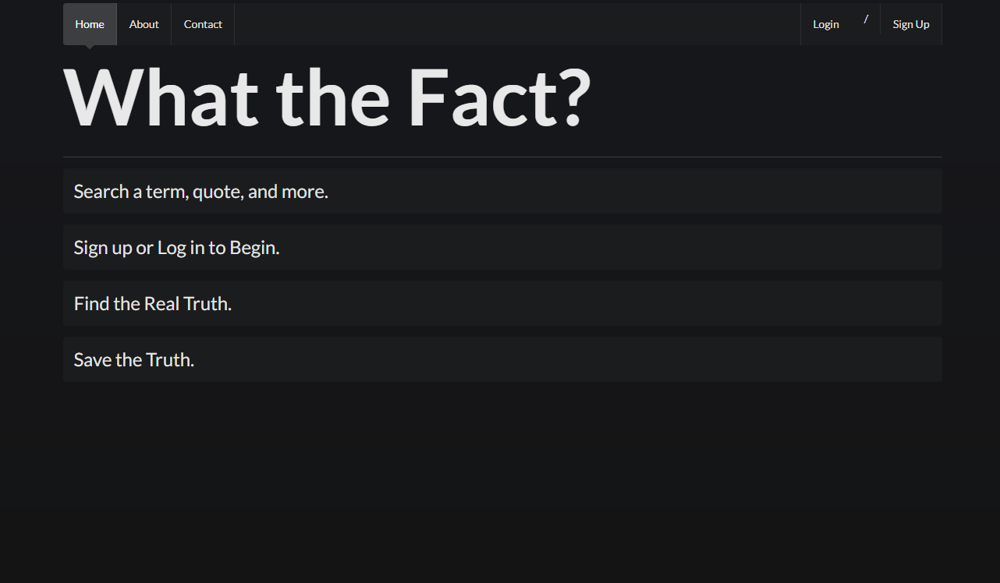

# What The Fact

### A site that helps gauge whether a claim is true or not.

## Table of Contents
* [Description](Description)
* [Technologies Used](Technologies_Used)
* [Deployed Site](Deployed)
* [Features](Features)
* [Other](Other)
* [Usage](Usage)
* [Author](Author)
* [Credits](Credits)
* [License](License)

## Description
We wanted a cleaner, easy to use website. Part of making it easy to use was making it mobile responsive.

## Technologies_Used
* JavaScript 
* HTML
* CSS
* [express.js](https://expressjs.com/)
* [express-sessions](https://www.npmjs.com/package/express-session)
* [node.js](https://www.npmjs.com/)
* [mysql](https://www.mysqltutorial.org/)
* [jQuery](https://jquery.com/)
* [passport.js](http://www.passportjs.org/)
* [sequelize](https://github.com/sequelize/sequelize/)
* [bcrypt.js](https://www.npmjs.com/package/bcryptjs) 
* [Semantic UI](https://semantic-ui.com/)
* [Google Fact Check API](https://developers.google.com/fact-check/tools/api)

## Deployed Site
[What-the-Fact](https://what-the-fact.herokuapp.com/)

## Features 

### __1. A Claim Search__

_What?_

A search that allows you not to simply search terms, but identify claims associated with terms and rates whether they are true or not. 

_Why?_

Even if you are smart, even if you are aware of the daily news and consider yourself a critical thinker, on occasion, something will slip by you. Some little tidbit, some little piece of something will weasel itself into your brain and you will "KNOW" it, you will share it, you will argue for it and you will convince your friends and family member that this is the truth. That this is the fact. So, we wanted to help create a better tool, an easy one to use that will allow you to stop the misinformation and maybe, will help you exclaim "what the fact!?!?!" 

_How?_

Our claim search is primarily done using google's fact checker [API](https://developers.google.com/fact-check/tools/api). 

The biggest challenge using this API was figuring out where to call it and  getting it to display on English results (as our site is only in English). In order to resolve our language issue we inserted a bit of code into the original API code that set the language to en

### __2. Easy to View Claim Searches__

_What?_

We created a box that holds small cards that display all the information given to us by the API. The cards have a scroll bar in order to better serve the user and the box they are contained scrolls as well.

_Why?_

One of the most important points we all agreed on early in the build of this project was that we wanted to create something beautiful and easy to use. Being able to easily select the claim and have it show up nicely was paramount.

_How?_

We used semantic UI to build the boxes and give them color. 

### __3. A User profile__

_What?_

A simple page built just for you to keep your searches. 

_Why?_

So that users can save their searches and their data. Sure you can copy the information down into a word document or onto a piece of paper but, that's not always convenient, is it? Unless you are a scientist working in a remote rain forest it is unlikely you will carry a notebook and pen with you where ever you go. And if you wanted to ever refer back to your search you might be willing to go through the whole process of searching up all the different terms again or you might want things to save conveniently to your own profile. 

_How?_

This was a complex task to achieve as a developer. Not because the page was overly difficult to design but because it was difficult to conceptualize. We had several ideas on how to set up our user profile and build it:

    1. Create a members only website, where you have to log in to use the fact check and you can save your searches 
    2. Create a front end search and a user search that has a button that allows you to save your searches into either a:
        a. a database
        b. local storage    

In the end we chose to do secret option number 3, using the first page to display instructions (per our user friendly mission) and then have a user sign in to save searches onto a database. 

When a user types in the search box, a query is run for the term that is being searched in user.js where results are then posted in the form of "data" and run through a jquery call-using a for loop and some html to make it sit correctly on the page. 
 
 

### __4. A saved search__

_What?_

An option for having a user to save the search title they just made for later reading. The article details are saved to a profile page that the user can access later. 

_Why?_

This too, fit into our goal of making an easy to use fact-checker website. Being able to store ideas to either share with people later or refer back to. Saving websites/data and information can get convoluted and messy with multiple devices and ways of trying to view things so we wanted to help our user be organized with their search results. 

_How?_

For our saved searches, how it works is that when a user would like to look up any facts and find out if any articles, statements are true or false, the user can save them with the “Save Fact” button and look over their saved searches later on which goes into the “Profile” page and logs all their saved searches. We did want to incorporate a delete button for each saved fact in case they wouldn’t like it in their saved searches page anymore. It’s a great way for those who want to read up on the article more and save these articles in a way they could do more in depth research.

##  Other

 __For later builds__

 1. twitter fact check -reads through tweets and uses response to enter into the fact check api
 2. Comments section
 3. Icons/images that show up with claims
 4. A Logo to go with the page 

## Usage
### This site is for anyone. Anyone who finds themselves lost in the world of information that the modern world grants us and would like a little more clarity, insight and direction in that world. 
    

## Authors 

Janessa Fong

* [linkedin] (hhttps://www.linkedin.com/in/janessafong) 

* [github] (https://github.com/janessaref)

* [portfolio](https://rksouth.github.io/responsive_portfolio/)

Rachael Kelm-Southworth

* [linkedin] (https://www.linkedin.com/in/rachael-kelm-southworth-87a3831b3) 

* [github] (https://github.com/RKSouth/)

* [portfolio](https://rksouth.github.io/responsive_portfolio/)

Aaron Diggdon

* [github] (https://github.com/aarondig)

 ## Credits

I would like to thank Kerwin, Manuel, Jerome, Roger and all my classmates for helping me understand this subject matter and anyone that contributed to make the base code.

## License
[MIT](https://choosealicense.com/licenses/mit/)